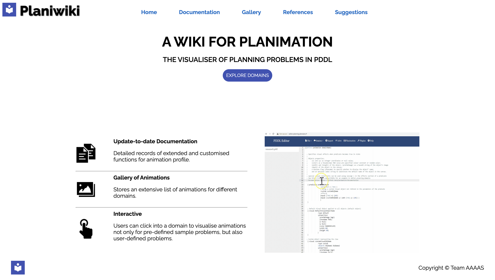
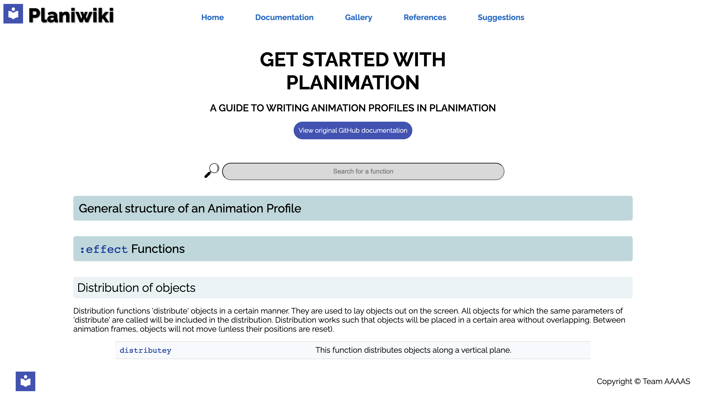
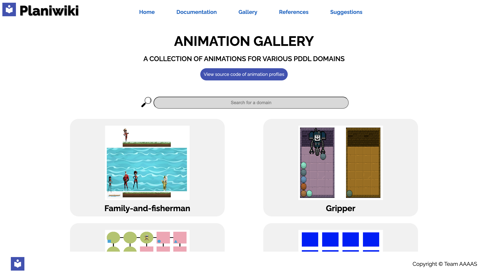
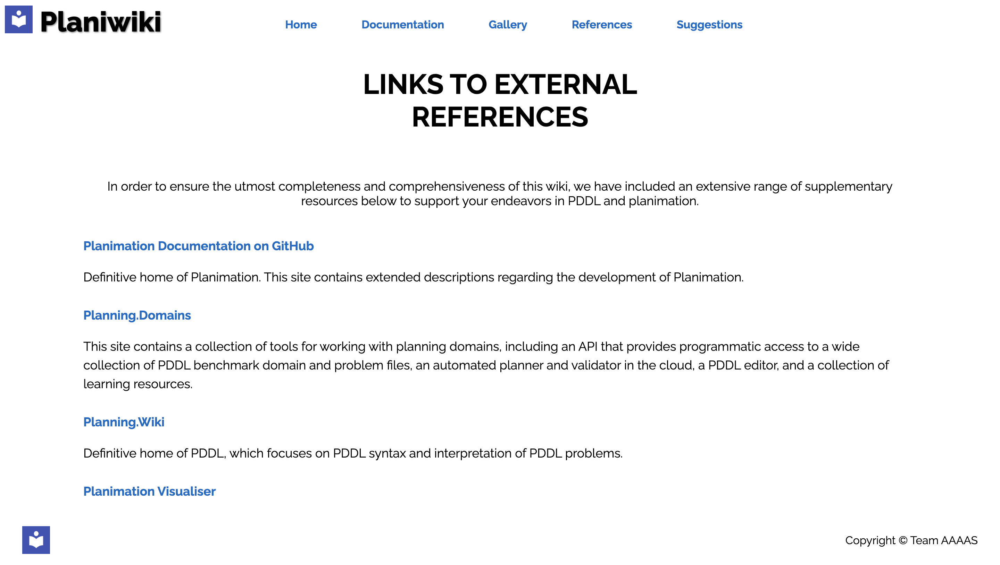
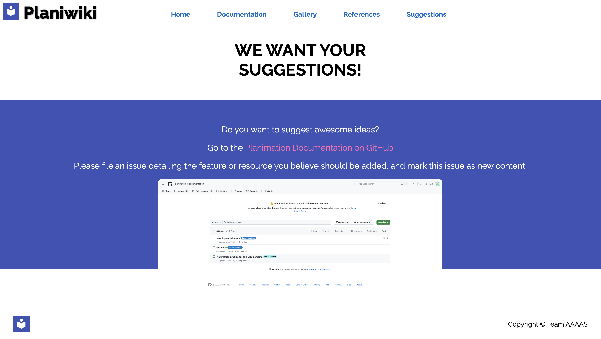
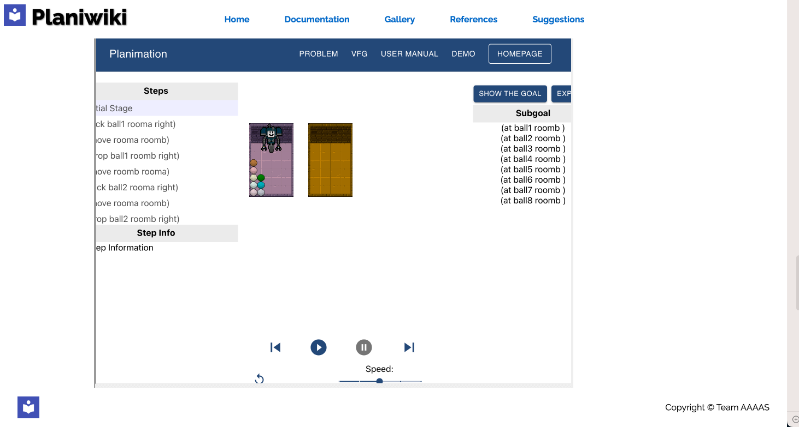

# Planiwiki
[](#contributors)
[](https://github.com/7angel4/planimation-website/blob/master/LICENSE)


Planiwiki serves as an extension to the [Planimation Documentation Page](https://planimation.github.io/documentation/). The original site lacked documentations on some important functions, and also didn't have many sample animations for visitors to truly appreciate the magnificence of Planimation. In an attempt to tackle the aforementioned issues, as well as promoting Planimation among students and researchers in the field of artificial intelligence, Planiwiki is created.

## Demo
<table border="0">
 <tr>
    <td></td>
    <td></td>
    <td></td>
 </tr>
 <tr>
    <td></td>
    <td></td>
    <td></td>
 </tr>
</table>

[Live Demo](https://planimation-staging-181bc.web.app/)

## Key features
- Extensive description on Planimation-specific functions with video demonstrations and code examples.
- More description on existing domains, along with easily accessible and executable source code.
- A reference page linking to other PDDL resources.
- Accepting community recommendations and suggestions.

## Documentation
[User Stories](docs/user_stories.pdf)
### Models & Diagrams
- [Motivational Model](docs/motivational_model.pdf)
- [Domain Model](docs/domain_model.pdf)
- [System Sequence Diagram](docs/system_sequence_diagram.pdf)
- [Architecture Diagram](docs/architecture_diagram.pdf)
- [Website Database Schema](docs/website_database_schema.pdf)
- [Deployment View](docs/deployment_view.pdf)

### Test Cases

## Technical Details
### System requirements
- Node.js (v18.16.0)
- Firebase (12.5.4)
- Git (2.30.1)

### Setting up

#### Node.js Installation
1. *Navigate to project root directory*
   
2. *Install Node.js and npm (if not already installed)*:
   - You can download and install Node.js from the official website. npm is included with Node.js.
   - Alternatively, if you have Homebrew installed, you can use it to install Node.js and npm: `brew install node`

#### Firebase access
Email Yezihanz@student.unimelb.edu.au for access to firebase.

#### Firebase Installation
1. *Navigate to project root directory*
     
2. *Install the Firebase Command line Interface (CLI) Tools*:
   Once you have npm installed, you can install the Firebase CLI using the following command:
    ```
    $ npm install -g firebase-tools
    ```
   
3. *Verify the Installation*:
   After the installation is complete, you can verify it by checking the version of the Firebase CLI:
    ```
    $ firebase --version
    ```
   
4. *Login to Firebase*:
   To interact with your Firebase projects, you'll need to authenticate with your Google account (the one that was given Firebase access):
    ```
    $ firebase login
    ```
   - This command will open a new browser window asking you to authenticate with your Google account. Once authenticated, the CLI will be linked to your Firebase projects.

5. Initialise your local project as Firebase project:
    ```
    $ firebase init
    ```
    Follow the prompts to initialize. Follow the default answer unless otherwise stated below:
    - For the step `Which Firebase features do you want to set up for this directory?`, select `Firestore`, `Functions`, `Hosting` (the first out of two), `Emulators`.
    - For the step `Would you like to initialize a new codebase, or overwrite an existing one?`, select `Overwrite`.
  
#### Deployment
- Deploy using emulator:
    ```
    $ firebase emulators:start
    ```
- Deploy to website:
    ```
    $ firebase deploy
    ```
## Changelog
[version history](VERSIONS.md)
  
## Contributors
<!-- ALL-CONTRIBUTORS-LIST:START - Do not remove or modify this section -->
<!-- prettier-ignore -->
| [<br /><sub><b>Tony He</b></sub>](https://github.com/TonyYHe)<br />[💻](https://github.com/7angel4/planimation-website/commits?author=TonyYHe "Code") | [<br /><sub><b>Angel He</b></sub>](https://github.com/7angel4)<br />[💻](https://github.com/7angel4/planimation-website/commits?author=7angel4 "Code") | [<br /><sub><b>Shutong Luo</b></sub>](https://github.com/aningddd)<br />[💻](https://github.com/7angel4/planimation-website/commits?author=aningddd "Code") | [<br /><sub><b>Angela Yuan</b></sub>](https://github.com/AngieYYF)<br />[💻](https://github.com/7angel4/planimation-website/commits?author=AngieYYF "Code") | [<br /><sub><b>Yezihan Zhou</b></sub>](https://github.com/A-lan-Z)<br />[💻](https://github.com/7angel4/planimation-website/commits?author=A-lan-Z "Code") |
| :---: | :---: | :---: | :---: | :---: |
<!-- ALL-CONTRIBUTORS-LIST:END -->
